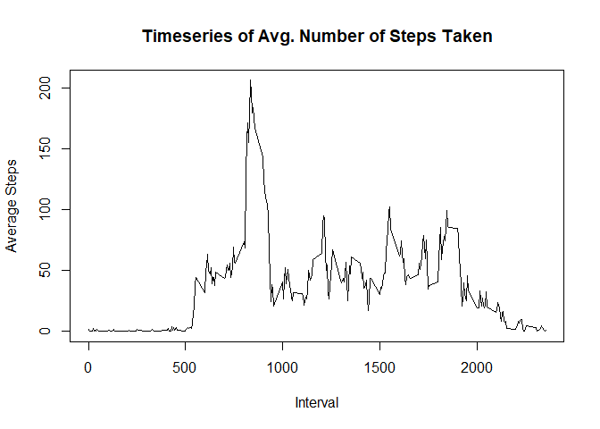

## Loading and preprocessing the data

First let's load the packages we'll need

```r
library(dplyr)
library(lubridate)
library(stringr)
library(ggplot2)
```

Then let's load the dataset into memory

```r
activityData <- read.csv("activity.csv")
```

## What is mean total number of steps taken per day?

1.Calculate the total number of steps taken per day

```r
byDay <- activityData %>% group_by(date)
sumByDay <- summarize(byDay, totalSteps=sum(steps))
```

2.Make a histogram of the total number of steps taken each day

```r
hist(sumByDay$totalSteps, 
     main = "Histogram of total steps taken each day", 
     xlab = "Number of steps")
```

<!-- -->

3.Calculate and report the mean and median of the total number of steps taken
per day

```r
mean(sumByDay$totalSteps, na.rm = T)
```

```
## [1] 10766.19
```

```r
median(sumByDay$totalSteps, na.rm = T)
```

```
## [1] 10765
```

## What is the average daily activity pattern?

1.Make a time series plot (i.e. \color{red}{\verb|type = "l"|}type = "l") of 
the 5-minute interval (x-axis) and the average number of steps taken, averaged 
across all days (y-axis)

```r
byInterval <- activityData %>% group_by(interval)
avgByInterval <- summarize(byInterval, avgSteps=mean(steps, na.rm = T))
plot(avgByInterval$interval, 
     avgByInterval$avgSteps, 
     type = "l", 
     main = "Timeseries of Avg. Number of Steps Taken", 
     xlab = "Interval", 
     ylab = "Average Steps")
```

<!-- -->

2.Which 5-minute interval, on average across all the days in the dataset, 
contains the maximum number of steps?

```r
paste("The maximum avg number of steps is", max(avgByInterval$avgSteps), 
      "in an interval")
```

```
## [1] "The maximum avg number of steps is 206.169811320755 in an interval"
```

```r
paste("And that interval is the",
      paste(avgByInterval$interval[which.max(avgByInterval$avgSteps)], 
            "th", 
            sep=""), 
      "considering all days")
```

```
## [1] "And that interval is the 835th considering all days"
```

## Imputing missing values

1.Calculate and report the total number of missing values in the dataset (i.e. 
the total number of rows with \color{red}{\verb|NA|}NAs)

```r
sum(is.na(activityData))
```

```
## [1] 2304
```

2.Devise a strategy for filling in all of the missing values in the dataset. 
The strategy does not need to be sophisticated. For example, you could use the 
mean/median for that day, or the mean for that 5-minute interval, etc.

We'll use the daily average to populate the missing values.
But as the intervals with NAs span the whole days, first we replace
the NAs with zeroes.

```r
avgByDay <- summarize(byDay, avgSteps=mean(steps))
avgByDay$avgSteps[is.na(avgByDay$avgSteps)] <- 0
```

3.Create a new dataset that is equal to the original dataset but with the 
missing data filled in.

```r
noNAs <- activityData
noNAs[is.na(noNAs),]$steps <- 
    avgByDay[match(noNAs[is.na(noNAs),]$date, avgByDay$date), 2]$avgSteps
sum(is.na(noNAs))
```

```
## [1] 0
```
There's no more missing data!

4.Make a histogram of the total number of steps taken each day and Calculate and
report the mean and median total number of steps taken per day. Do these values 
differ from the estimates from the first part of the assignment? What is the 
impact of imputing missing data on the estimates of the total daily number of 
steps?

```r
byDayNoNAs <- noNAs %>% group_by(date)
sumByDayNoNAs <- summarize(byDayNoNAs, totalSteps=sum(steps))
hist(sumByDayNoNAs$totalSteps, 
     main = "Histogram of total steps taken each day (no NAs)", 
     xlab = "Number of steps")
```

<!-- -->

```r
mean(sumByDayNoNAs$totalSteps)
```

```
## [1] 9354.23
```

```r
median(sumByDayNoNAs$totalSteps)
```

```
## [1] 10395
```
As there were some days with zero steps and these values were ignored before
(with na.rm=T), naturally the histogram column for 0-5000 increased and the
mean and median decreased.
Other than that, the distribution seems to be very much the same.

## Are there differences in activity patterns between weekdays and weekends?

1.Create a new factor variable in the dataset with two levels – “weekday” and 
“weekend” indicating whether a given date is a weekday or weekend day.

```r
days <- weekdays(ymd(noNAs$date))
dayType = vector(length=length(days))
dayType[days=="sábado" | days=="domingo"] <- "weekend"
dayType[!(days=="sábado" | days=="domingo")] <- "weekday"
noNAs$dayType <- as.factor(dayType)
```

2.Make a panel plot containing a time series plot 
(i.e. \color{red}{\verb|type = "l"|}type = "l") of the 5-minute interval 
(x-axis) and the average number of steps taken, averaged across all weekday days
or weekend days (y-axis).

```r
byIntervalAndDayType <- noNAs %>% group_by(interval, dayType)
avgByIntervalAndDayType <- summarize(byIntervalAndDayType, avgSteps=mean(steps))
qplot(interval, avgSteps, data=avgByIntervalAndDayType, facets=dayType~.) + 
    geom_line() + 
    theme(plot.title=element_text(hjust=0.5)) + 
    labs(title = "Avg. Steps (weekdays x weekends)", x="Interval", y="Steps")
```

<!-- -->
